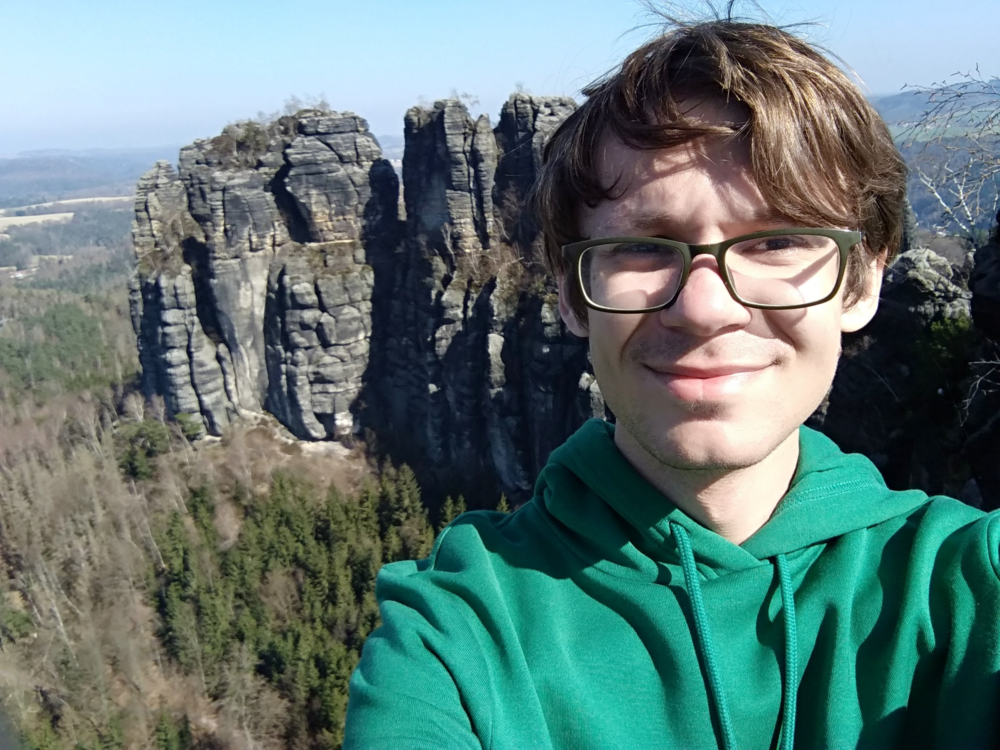

<!-- (comment) the image below can be found in img folder of this very project-->
<!--{: style="float: right; margin: 0px 20px; width: 360px;" name="me"}-->
{: style="float: right; margin: 0px 20px; width: 360px;" name="me"}

I'm Maksim Valialshchikov, a __Ph.D. student__ at Skolkovo Institute of Science and Technology supervised by Sergey Rykovanov. I work in the field of Computational Physics and Neural Networks in Physics.

...

...

...

...

## News 

__2022__

* __January-April__ Internship at Helmholtz Institute Jena, Jena, Germany in a group of Prof. Dr. Matt Zepf. Supported with DAAD scholarship.

__2021__

* __November__ Started PhD at Skolkovo Institute of Science and Technology.

* __August__ I'm awarded DAAD Young Talents Programme Linie A.

* __August__ <u>Papers:</u> [Polarisation gating technique in nonlinear Compton scattering: effect of radiation friction and electron beam nonideality](https://iopscience.iop.org/article/10.1070/QEL17616) accepted to __Quantum Electronics__.

* __July__ Summer school. Russian Academy of AI, Sirius, Sochi.

* __June__ Finished my MSc degree in Information Science and Technology at Skoltech!

* __June__ Skoltech Best Research Award.

* __May__ Skoltech President Scholarship.

* __April__ <u>Papers:</u> [Narrow Bandwidth Gamma Comb from Nonlinear Compton Scattering Using the
Polarization Gating Technique](https://arxiv.org/abs/2011.12931) accepted to __Physical Review Letters__.

* __April__ <u>Papers:</u> [On the Usage of Tapered Undulators in the Measurement of Interference in the Intensity-Dependent Electron Mass Shift](https://www.mdpi.com/2073-4352/11/5/486) accepted to __Crystals__.

* __January__ <u>Short talk:</u> [The Schwinger Effect and Strong-Field Physics](https://www2.yukawa.kyoto-u.ac.jp/~schwinger-effect/Home/)
